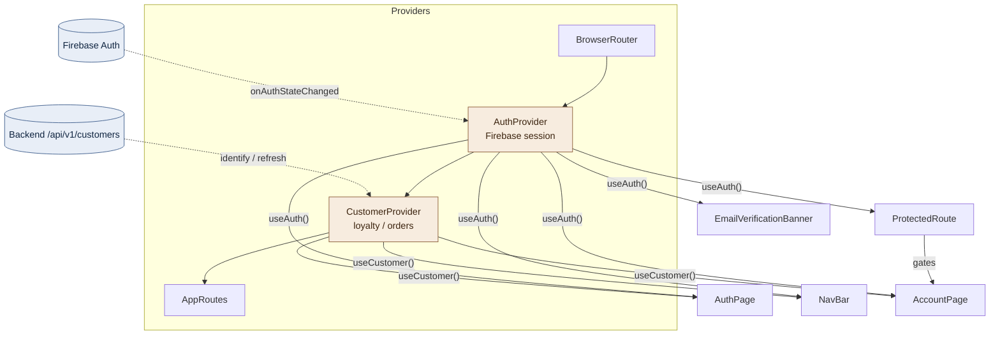
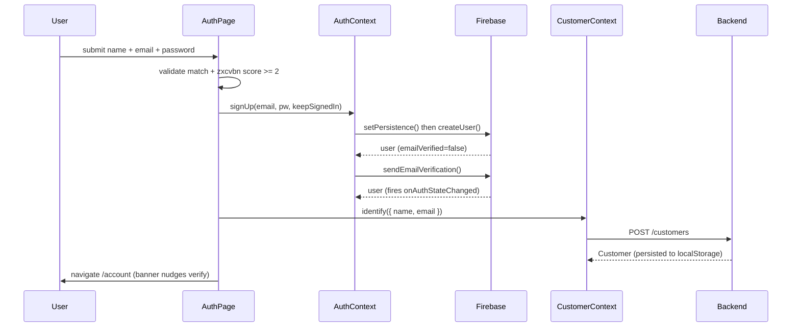
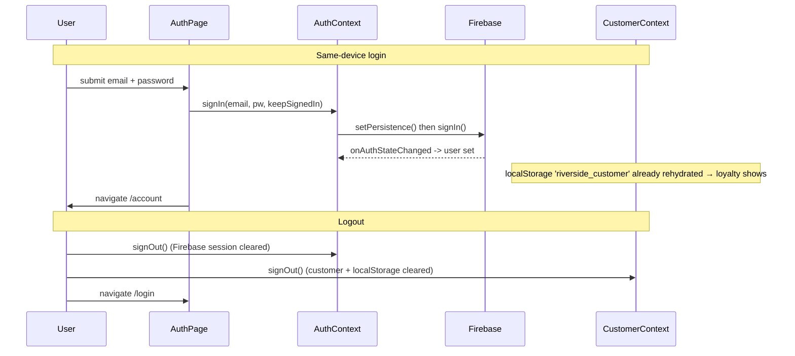

# Customer Auth Architecture

Firebase Authentication for the Riverside Books customer app. Two React contexts,
joined by email: **AuthContext** owns the credential/session (Firebase); **CustomerContext**
owns the loyalty/order record (backend). They never import each other — components that
need both consume both hooks.

## Provider tree & context wiring



`onAuthStateChanged` is the single source of truth: nothing sets `user` by hand. Every
login/logout/signup flows through Firebase's listener, which updates AuthContext, which
re-renders every consumer — so the navbar and route guard stay in sync automatically.

## Signup flow



## Login & logout



## Route gating

```mermaid
flowchart LR
    R[/account request/] --> PR{ProtectedRoute<br/>useAuth()}
    PR -->|loading| S[Spinner]
    PR -->|no user| L[Navigate to /login]
    PR -->|user| A[AccountPage]
    A --> C{customer in<br/>localStorage?}
    C -->|yes| Acc[Loyalty + order history]
    C -->|no, new device| Rec[Reconnect loyalty card<br/>identify by email]
```

## Known limitation: cross-device loyalty

On a new device, Firebase login succeeds but there is no public endpoint to fetch a
Customer by email/uid (`GET /customers` is staff-only). So loyalty history can't
auto-restore — the **Reconnect** card re-links by email instead. True cross-device
restore needs a backend `firebaseUid` column + an authenticated `GET /customers/me`,
deferred for now.
